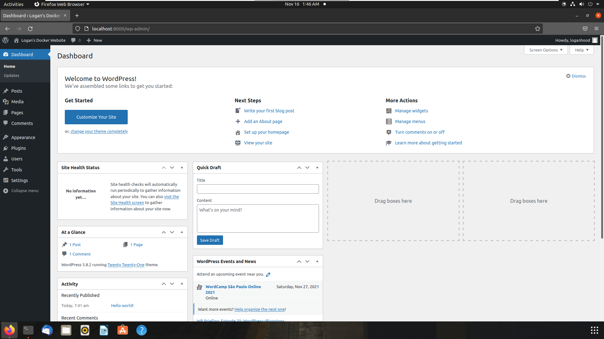

# Wordpress Installtion on Docker

## Compose Installation
We first need to install Docker Compose so we can make a YAML file to define the services we need for our WordPress server.

1. Run the following command to install the latest release of Docker Compose:
```
sudo curl -L "https://github.com/docker/compose/releases/download/1.29.2 docker-compose-$(uname -s)-$(uname -m)" -o /usr/local/bin/docker-compose
```

2. Apply executable permissions:
```
 sudo chmod +x /usr/local/bin/docker-compose
```

3. Test that the installation was successful:
```
docker-compose -v
```

## Wordpress installation
1. Make a directory for your site and change into it:
```
mkdir logan_wordpress
cd logan_wordpress
```

2. Create a `docker-compose.yml` file that starts the WordPress site and MySQL instance:
```
touch docker-compose.yml
```

3. Edit the file with the following:  
```
version: "3.9"

services:
  db:
  image: mysql:5.7
    volumes:
      - db_data:/var/lib/mysql
    restart: always
    environment:
      MYSQL_ROOT_PASSWORD: password
      MYSQL_DATABASE: wordpress
      MYSQL_USER: wordpress
      MYSQL_PASSWORD: wordpress
    
  wordpress:
    depends_on:
      - db
    image: wordpress:latest
    volumes:
      - wordpress_data:/var/www/html
    ports:
      - "8000:80"
    restart: always
    environment:
      WORDPRESS_DB_HOST: db:3306
      WORDPRESS_DB_USER: wordpress
      WORDPRESS_DB_PASSWORD: wordpress
      WORDPRESS_DB_NAME: wordpress
volumes:
  db_data: {}
  wordpress_data: {}
```

4. Build the website:
```
sudo docker-compose up -d
```
5. Access http://localhost:8000 in a web browser.
6. Complete the installation steps on the page.

Your website should now be set up. You can edit the page with WordPress Admin interface.





## Resources
- https://docs.docker.com/compose/install/
- https://docs.docker.com/samples/wordpress/
